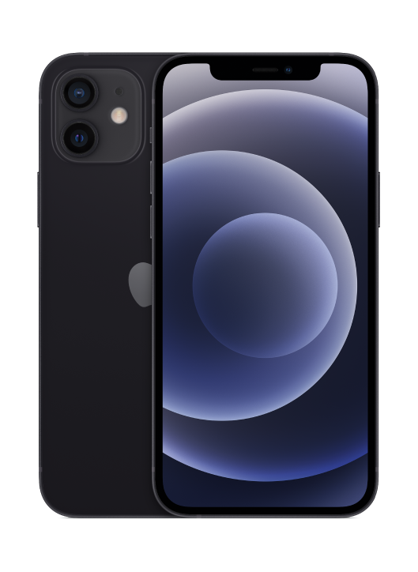
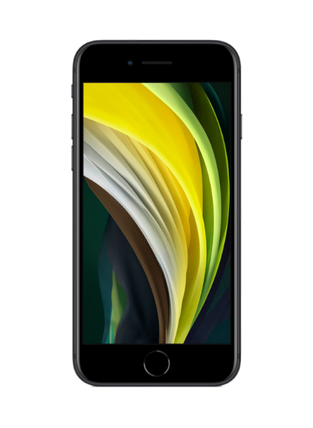
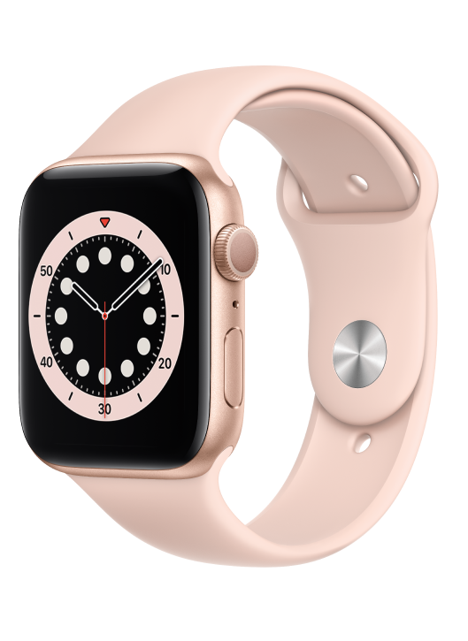
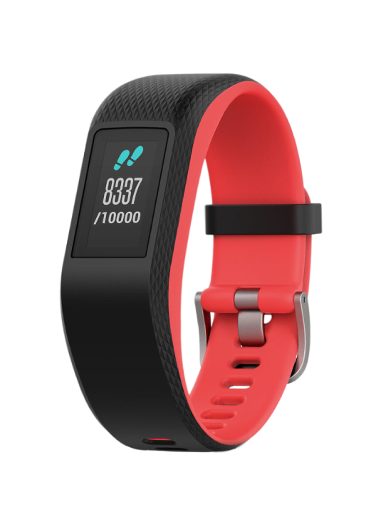

ELABORADO POR CLENIO CANJAMBA

<!-----------------------------------GLIDE--------------------------------- !------------------------->

  

    <ul class="glide__slides">
      <li class="glide__slide"></li>
      <li class="glide__slide"></li>
      <li class="glide__slide"></li>
      <li class="glide__slide"></li>
    </ul>
  

  

    <button class="glide__arrow glide__arrow--left" data-glide-dir="<">prev</button>
    <button class="glide__arrow glide__arrow--right" data-glide-dir=">">next</button>
  

<!------------------------------------GLIDE-------------------------------- !------------------------->

			

              

                <ul class="glide__slides">
                  <li class="glide__slide"><h4 class="color1" align="center">iPhone12</h4><h4 class="color2" align="center">1 080 000,00 Kz</h4></li>

                  <li class="glide__slide"><h4 class="color1" align="center">iPhone SE</h4><h4 class="color2" align="center">485 000,00 Kz</h4></li>

                  <li class="glide__slide"><h4 class="color1" align="center">Samsung Galaxy A10s</h4><h4 class="color2" align="center">144 000,00 Kz</h4></li>

                  <li class="glide__slide"><h4 class="color1" align="center">Xiaomi Redmi 9A</h4><h4 class="color2" align="center">135 000,00 Kz</h4></li>
                </ul>
              

              

                <button class="glide__arrow glide__arrow--left" data-glide-dir="<">prev</button>
                <button class="glide__arrow glide__arrow--right" data-glide-dir=">">next</button>
              

                

                ---------------------------------------------------------
                <h4 class="color1" align="center">iPhone12</h4><h4 class="color2" align="center">1 080 000,00 Kz</h4>

                    
<h4 class="color1" align="center">iPhone SE</h4><h4 class="color2" align="center">485 000,00 Kz</h4>

                    
<h4 class="color1" align="center">Samsung Galaxy A10s</h4><h4 class="color2" align="center">144 000,00 Kz</h4>

                    
<h4 class="color1" align="center">Xiaomi Redmi 9A</h4><h4 class="color2" align="center">135 000,00 Kz</h4>

                    <h4 class="color1" align="center">Apple Watch S6</h4><h4 class="color2" align="center">540 000,00 Kz</h4>

                    
<h4 class="color1" align="center">Garmín Vivosport</h4><h4 class="color2" align="center">149 900,00 Kz</h4>

                    
<h4 class="color1" align="center">Xiaomi Mi Band D5</h4><h4 class="color2" align="center">31 900,00 Kz</h4>

                    
<h4 class="color1" align="center">Apple Magsafe</h4><h4 class="color2" align="center">49 000,00 Kz</h4>

                    

              

                <ul class="glide__slides">
                  <li class="glide__slide"><h4 class="color1" align="center">Apple Watch S6</h4><h4 class="color2" align="center">540 000,00 Kz</h4></li>

                  <li class="glide__slide"><h4 class="color1" align="center">Garmín Vivosport</h4><h4 class="color2" align="center">149 900,00 Kz</h4></li>

                  <li class="glide__slide"><h4 class="color1" align="center">Xiaomi Mi Band D5</h4><h4 class="color2" align="center">31 900,00 Kz</h4></li>

                  <li class="glide__slide"><h4 class="color1" align="center">Apple Magsafe</h4><h4 class="color2" align="center">49 000,00 Kz</h4></li>
                </ul>
              

              

                <button class="glide__arrow glide__arrow--left" data-glide-dir="<">prev</button>
                <button class="glide__arrow glide__arrow--right" data-glide-dir=">">next</button>
              

                
